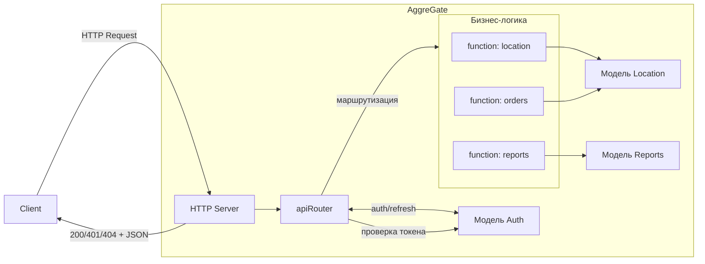

## Введение

При интеграции внешних систем с AggreGate разработчики чаще всего опираются на встроенный REST-сервер. На практике быстро выясняется: его архитектура заметно отличается от канонов классического REST.

В этой статье разберём эти отличия, посмотрим, какие ограничения из них следуют, и покажем, как собрать полноценный, безопасный и предсказуемый REST API на базе встроенного HTTP-сервера AggreGate и собственной логики.

---

## Классический REST vs REST в AggreGate

Чтобы понять корень проблем, сравним две парадигмы работы с данными.

### 1. Структура URL и модель ресурсов

| Классический REST | AggreGate REST API |
| --- | --- |
| Ресурсы соответствуют бизнес-сущностям: `/users`, `/products/{id}`. | Ресурсы жёстко привязаны к **контекстам платформы**: `/contexts/{path}/variables/{var}`, `/contexts/{path}/functions/{func}`. |
| Плоская или логически вложенная структура. | Иерархическая структура, отражающая внутреннее устройство платформы, а не бизнес-логику. |

### 2. Гибридная модель работы с данными

| Классический REST | AggreGate REST API |
| :--- | :--- |
| Чёткое соответствие HTTP-методов операциям CRUD (GET, POST, PUT, PATCH, DELETE). | **GET** — чтение контекстов и переменных.<br>**PUT/PATCH** — работа *только* с переменными.<br>**POST** — аутентификация и вызов функций.<br>Классические операции создания и удаления сущностей отсутствуют: их эмулируют через вызов функций. |

### 3. Выполнение функций как основной паттерн

В AggreGate вызов функции (`POST /contexts/{path}/functions/{name}`) — универсальный механизм для любых действий: от создания записи до сложной бизнес-логики. Это фундаментально расходится с REST-принципом, где действия привязаны к ресурсам, а не к процедурам.

### 4. Структура данных и ответы сервера

В классическом REST мы свободно оперируем JSON-объектами. В AggreGate картина другая:

* корневой объект входящих и исходящих данных часто должен выглядеть как таблица (`DataTable`), которая затем сериализуется в JSON;
* отдать «голый» JSON сложно: приходится либо собирать табличную структуру, либо экранировать JSON как строку внутри текстовой переменной.

---

## Практические последствия и «боли» разработчика

Использование встроенного REST «как есть» приводит к ряду серьёзных архитектурных компромиссов.

1. **Нет гибкого роутинга.** Красивый эндпоинт вида `/api/v1/orders/123` из коробки не получить. Обычно перед AggreGate ставят reverse-proxy (например, Nginx) — инфраструктура усложняется.
2. **Нарушение семантики HTTP.** Платформа не даёт гибко управлять HTTP-статусами и заголовками ответа. Ошибки валидации и бизнес-логики часто сводятся к стандартному `400 Bad Request` без детализации в теле: подробности уходят только в серверные логи.
3. **Проблемы безопасности.** При прямом доступе к REST-серверу с валидным токеном клиент получает доступ ко *всем* контекстам, доступным пользователю, от имени которого выдан токен. Разграничить права на уровне отдельных эндпоинтов трудно.
4. **Антипаттерн «Uniform Response».** Из-за невозможности управлять HTTP-статусами ответы часто заворачивают в оболочку вида:

```json
{
  "status": "error",
  "code": 4001,
  "message": "Недостаточно средств",
  "data": null
}
```

Почему это плохо: ломается кэширование, страдает мониторинг (для прокси все запросы выглядят как `200 OK`), нарушаются стандарты HTTP — коды `4xx` и `5xx` как раз и предназначены для сигнализации об ошибках.

---

## Решение: свой API-шлюз внутри AggreGate

В AggreGate есть встроенный HTTP-сервер, который позволяет гибко задавать коды ответов (`responseStatus`), заголовки (`responseContentType`) и тело ответа (`responseBody`).

Главный недостаток: по умолчанию его эндпоинты не защищены авторизацией.

### Стратегия аутентификации

Исправить это можно двумя способами:

1. Использовать токены, выданные стандартным REST API, и проверять их вручную в каждом запросе.
2. Реализовать собственную выдачу и проверку JWT. Мы выбираем этот вариант: он даёт полный контроль и позволяет полностью отключить стандартный REST API для внешних потребителей.

### Алгоритм работы

1. **Авторизация.** Клиент отправляет `POST /api/auth` с учётными данными. Сервер проверяет их и возвращает пару `access_token` и `refresh_token` со статусом `200`. При ошибке — `401`.
2. **Доступ к данным.** Клиент передаёт `Bearer <access_token>` в заголовке. Сервер проверяет подпись и срок действия. При успехе выполняет логику и возвращает `200`, при провале — `401`.
3. **Обновление токена.** Клиент обращается к `/api/refresh` с `refresh_token`. Сервер проверяет его, аннулирует старый и выдаёт новую пару. Для хранения состояния refresh-токенов используется история переменной с TTL, равным времени жизни токена.

---

## Реализация

Создадим модель `auth` и соответствующие функции / rule sets.

| name | expression |
| --- | --- |
| checkUser | |
| createToken | |
| checkToken | |
| checkAuth | callFunction(dc(), "rsCheckAuth", dt()) |
| getToken | callFunction(dc(), "rsGetToken", dt()) |
| refreshToken | callFunction(dc(), "rsRefreshToken", dt()) |

### Rule set: rsGetToken

| target | expression | condition | comment |
| --- | --- | --- | --- |
| data | dt() | | |
| requestBody | catch(tableFromJSON(cell({env/data}, "requestBody")), null) | | |
| Final Rule Set Result | set(<br>&emsp;set(<br>&emsp;&emsp;set(dt(), "responseStatus", 0, 401)<br>&emsp;&emsp;, "responseContentType", 0, "application/json"<br>&emsp;)<br>&emsp;, "responseBody", 0, ""<br>) | {env/requestBody} == null | |
| username | catch(cell({env/requestBody}, "username"), null) | | |
| password | catch(cell({env/requestBody}, "password"), null) | | |
| Final Rule Set Result | set(<br>&emsp;set(<br>&emsp;&emsp;set(dt(), "responseStatus", 0, 401)<br>&emsp;&emsp;, "responseContentType", 0, "application/json"<br>&emsp;)<br>&emsp;, "responseBody", 0, ""<br>) | {env/username} == null \|\| {env/password} == null | |
| isValid | cell(callFunction(dc(), "checkUser", {env/username}, {env/password})) | | |
| Final Rule Set Result | set(<br>&emsp;set(<br>&emsp;&emsp;set(dt(), "responseStatus", 0, 401)<br>&emsp;&emsp;, "responseContentType", 0, "application/json"<br>&emsp;)<br>&emsp;, "responseBody", 0, ""<br>) | !{env/isValid} | |
| token | callFunction(dc(), "createToken", {env/username}, "qkAoaitQ2BIwmlcAKr2lh606yb7vH54o", 3600000, 86400000) | | |
| Final Rule Set Result | set(<br>&emsp;set(dt(), "responseBody", 0<br>&emsp;&emsp;, '{"access_token":"' + cell({env/token}, "accessToken") + '","refresh_token":"' + cell({env/token}, "refreshToken") + '"}')<br>&emsp;, "responseContentType", 0, "application/json"<br>) | | |

### Rule set: rsRefreshToken

| target | expression | condition | comment |
| --- | --- | --- | --- |
| data | dt() | | |
| refreshToken | replace(cell(cell(filter(cell({env/data}, "headers"), "{name} == '" + "authorization" + "'"), "values")), "Bearer ", "") | |Выкусываем токен из заголовка|
| isExist | records(<br>&emsp;filter(<br>&emsp;&emsp;callFunction("utilities", "variableHistory", dc(), "refreshTokens", null, null)<br>&emsp;&emsp;, "{values} == '" + {env/refreshToken} + "'"<br>&emsp;)<br>)  > 0 | |Проверяем, что такой токен ранее не использовался|
| Final Rule Set Result | set(<br>&emsp;set(<br>&emsp;&emsp;set(dt(), "responseStatus", 0, 401)<br>&emsp;&emsp;, "responseContentType", 0, "application/json"<br>&emsp;)<br>&emsp;, "responseBody", 0, ""<br>) | {env/isExist} |Если использовался, то 401|
| checkToken | callFunction(dc(), "checkToken", "qkAoaitQ2BIwmlcAKr2lh606yb7vH54o", {env/refreshToken}) | | |
| isValid | cell({env/checkToken}, "valid") | |Если нет, то проверяем валидность.|
| Final Rule Set Result | set(<br>&emsp;set(<br>&emsp;&emsp;set(dt(), "responseStatus", 0, 401)<br>&emsp;&emsp;, "responseContentType", 0, "application/json"<br>&emsp;)<br>&emsp;, "responseBody", 0, ""<br>) | !{env/isValid} |Если токен не валидный, то 401|
| username | cell({env/checkToken}, "username") | | |
| saveToken | setVariable(dc(), "refreshTokens", {env/refreshToken}) | |Сохраняем refresh токен, как использованный|
| token | callFunction(dc(), "createToken", {env/username}, "qkAoaitQ2BIwmlcAKr2lh606yb7vH54o", 3600000, 86400000) | |Создаём новые токены. Здесь следует использовать ключ из HTTP плагина|
| Final Rule Set Result | set(<br>&emsp;set(dt(), "responseBody", 0<br>&emsp;&emsp;, '{"access_token":"' + cell({env/token}, "accessToken") + '","refresh_token":"' + cell({env/token}, "refreshToken") + '"}')<br>&emsp;, "responseContentType", 0, "application/json"<br>) | |Возвращаем токены|

### Rule set: rsCheckAuth

| target | expression | condition | comment |
| --- | --- | --- | --- |
| data | dt() | | |
| accessToken | replace(cell(cell(filter(cell({env/data}, "headers"), "lower({name}) == '" + "authorization" + "'"), "values")), "Bearer ", "") | | |
| checkToken | callFunction(dc(), "checkToken", "qkAoaitQ2BIwmlcAKr2lh606yb7vH54o", {env/accessToken}) | | |
| isValid | cell({env/checkToken}, "valid") | | |
| Final Rule Set Result | {env/isValid} | | |

Создадим переменную для хранения refresh-токенов:


### 1. Проверка учётных данных

Создадим функцию `checkUser`.

Она пытается выполнить системный вход с переданными данными: успех возвращает `true`, провал или исключение — `false`.

```java
import com.tibbo.aggregate.common.context.*;
import com.tibbo.aggregate.common.datatable.*;
import com.tibbo.aggregate.common.server.*;
import com.tibbo.linkserver.context.*;

public class %ScriptClassNamePattern% implements FunctionImplementation {
    public DataTable execute(Context con, FunctionDefinition def, CallerController caller,
            RequestController request, DataTable parameters) throws ContextException {
        
        String username = parameters.rec().getString("username");
        String password = parameters.rec().getString("password");

        DataRecord rec = new DataRecord(CommonServerFormats.FIFT_LOGIN);
        rec.setValue(RootContextConstants.FIF_LOGIN_USERNAME, username);
        rec.setValue(RootContextConstants.FIF_LOGIN_PASSWORD, password);
        rec.setValue(RootContextConstants.FIF_LOGIN_COUNT_ATTEMPTS, false);

        DefaultCallerController loginCaller = new DefaultCallerController(new ServerCallerData());
        loginCaller.logout(); // сбрасываем предыдущую сессию в рамках этого вызова

        DataTable output = new SimpleDataTable(def.getOutputFormat());
        try {
            con.getRoot().callFunction(RootContextConstants.F_LOGIN, loginCaller, rec.wrap());
            output.addRecord(true);
        } catch (ContextException e) {
            output.addRecord(false);
        }
        return output;
    }
}
```

### 2. Генерация JWT-токенов

Создадим функцию `createToken`.

Готовой пользовательской функции для этого нет, поэтому используем внутренний класс платформы `com.tibbo.aggregate.common.web.security.JwtTokenGenerator`. В качестве `secretKey` рекомендуется брать ключ из настроек плагина REST API.

```java
import com.tibbo.aggregate.common.context.*;
import com.tibbo.aggregate.common.datatable.*;
import com.tibbo.aggregate.common.server.*;
import com.tibbo.aggregate.common.web.security.JwtTokenGenerator;
import java.util.UUID;

public class %ScriptClassNamePattern% implements FunctionImplementation {
    public DataTable execute(Context con, FunctionDefinition def, CallerController caller,
            RequestController request, DataTable parameters) throws ContextException {
        
        String username = parameters.rec().getString("username");
        String secretKey = parameters.rec().getString("secretKey");
        long accessTtlMs = parameters.rec().getLong("accessTtlMs");
        long refreshTtlMs = parameters.rec().getLong("refreshTtlMs");

        JwtTokenGenerator generator = new JwtTokenGenerator(secretKey, accessTtlMs, refreshTtlMs);

        String accessToken = generator.generateAccessToken(username, UUID.randomUUID().toString(), null).getData();
        String refreshToken = generator.generateRefreshToken(username, UUID.randomUUID().toString(), null).getData();

        DataTable output = new SimpleDataTable(def.getOutputFormat());
        DataRecord row = output.addRecord();
        row.setValue("accessToken", accessToken);
        row.setValue("refreshToken", refreshToken);
        return output;
    }
}
```

### 3. Валидация токена

Создадим функцию `checkToken`.

Она проверяет подпись и срок действия.

> **Примечание.** В этом примере payload парсится через регулярные выражения — так проще держать пример автономным. В production при наличии возможности лучше использовать полноценную JSON-библиотеку.

```java
import com.tibbo.aggregate.common.context.*;
import com.tibbo.aggregate.common.datatable.*;
import com.tibbo.aggregate.common.server.*;
import java.nio.charset.StandardCharsets;
import java.util.Base64;
import java.util.regex.Matcher;
import java.util.regex.Pattern;

public class %ScriptClassNamePattern% implements FunctionImplementation {
    public DataTable execute(Context con, FunctionDefinition def, CallerController caller,
            RequestController request, DataTable parameters) throws ContextException {
        
        String secretKey = parameters.rec().getString("secretKey");
        String tokenStr = parameters.rec().getString("token");

        if (tokenStr != null) {
            String t = tokenStr.trim();
            if (t.length() >= 7 && t.regionMatches(true, 0, "Bearer ", 0, 7)) {
                tokenStr = t.substring(7).trim();
            }
        }

        DataTable output = new SimpleDataTable(def.getOutputFormat());
        DataRecord row = output.addRecord();

        try {
            String[] parts = tokenStr.split("\\.");
            if (parts.length != 3) throw new IllegalArgumentException("Invalid JWT format");

            String signed = parts[0] + "." + parts[1];
            javax.crypto.Mac mac = javax.crypto.Mac.getInstance("HmacSHA256");
            mac.init(new javax.crypto.spec.SecretKeySpec(secretKey.getBytes(StandardCharsets.UTF_8), "HmacSHA256"));
            byte[] hash = mac.doFinal(signed.getBytes(StandardCharsets.UTF_8));
            String computed = Base64.getUrlEncoder().withoutPadding().encodeToString(hash);

            if (!computed.equals(parts[2])) throw new SecurityException("Invalid signature");

            String payload = new String(base64UrlDecode(parts[1]), StandardCharsets.UTF_8);
            String username = jsonString(payload, "sub");
            String tokenId = jsonString(payload, "jti");
            long exp = jsonLong(payload, "exp");

            boolean expired = exp > 0 && exp * 1000L <= System.currentTimeMillis();

            row.setValue("valid", !expired);
            row.setValue("expired", expired);
            row.setValue("username", username);
            row.setValue("tokenId", tokenId);
            row.setValue("error", (String) null);
        } catch (Exception e) {
            row.setValue("valid", false);
            row.setValue("expired", true);
            row.setValue("username", (String) null);
            row.setValue("tokenId", (String) null);
            row.setValue("error", e.getMessage());
        }
        return output;
    }

    private static byte[] base64UrlDecode(String s) {
        int mod = s.length() % 4;
        if (mod > 0) s = s + "====".substring(mod);
        return Base64.getUrlDecoder().decode(s);
    }

    private static String jsonString(String json, String field) {
        Matcher m = Pattern.compile("\"" + field + "\"\\s*:\\s*\"([^\"]+)\"").matcher(json);
        return m.find() ? m.group(1) : null;
    }

    private static long jsonLong(String json, String field) {
        Matcher m = Pattern.compile("\"" + field + "\"\\s*:\\s*(\\d+)").matcher(json);
        return m.find() ? Long.parseLong(m.group(1)) : 0L;
    }
}
```

---

## Маршрутизация запросов (API Router)

Для управления потоком запросов создадим модель `apiRouter`. Она парсит URI, проверяет авторизацию и направляет запрос к нужной бизнес-модели.

| name | expression |
| --- | --- |
| apiRouter | callFunction(dc(), "rsApiRouter", dt()) |

### Rule set: rsApiRouter

| target | expression | condition | comment |
| --- | --- | --- | --- |
| data | dt() | | |
| uriTable | split(replace(cell(dt(), "requestURI"), "/hd/api/", ""), "/") | | |
| uri | lower(cell({env/uriTable})) | | |
| authModel | "users.admin.models.auth" | | |
| Final Rule Set Result | callFunction({env/authModel}, "getToken", dt()) | {env/uri} == "auth" | |
| Final Rule Set Result | callFunction({env/authModel}, "refreshToken", dt()) | {env/uri} == "refresh" | |
| isValid | cell(callFunction({env/authModel}, "checkAuth", dt())) | | |
| Final Rule Set Result | set(<br>&emsp;set(<br>&emsp;&emsp;set(dt(), "responseStatus", 0, 401)<br>&emsp;&emsp;, "responseContentType", 0, "application/json"<br>&emsp;)<br>&emsp;, "responseBody", 0, '{"result":"token is not valid"}'<br>) | !{env/isValid} | |
| Final Rule Set Result | set(<br>&emsp;callFunction("users.admin.models.api", {env/uri}, dt())<br>&emsp;, "responseContentType", 0, "application/json"<br>) | functionAvailable("users.admin.models.api", {env/uri}) | |
| Final Rule Set Result | set(<br>&emsp;set(<br>&emsp;&emsp;set(dt(), "responseStatus", 0, 404)<br>&emsp;&emsp;, "responseContentType", 0, "application/json"<br>&emsp;)<br>&emsp;, "responseBody", 0, ""<br>) | | |

### Архитектура взаимодействия



---

## Настройка HTTP-сервера


Создаём роут `/api` и правило обработки вызовов:

```
callFunction("users.admin.models.apiRouter", "apiRouter", dt())
```

В версии 6.4 эндпоинт будет доступен по адресу `/hd/api`.

Все запросы попадают в функцию `apiRouter` модели `apiRouter`: в зависимости от URI выдаётся токен, продлевается токен или отдаются данные.

Например, вызов `/hd/api/location/3` вызовет функцию `location` в модели `location` с параметром `3`.

В роутере можно обработать любые методы (`GET`, `POST`, `PUT`, `PATCH`, `DELETE`), просто проверяя поле `method` в `dt()`.

Однако здесь нас ждёт сюрприз. Если запросить у сервера `OPTIONS`, ответ будет таким:

```
Allow: GET, HEAD, POST, PUT, OPTIONS
vary: accept-encoding
Content-Encoding: gzip
Transfer-Encoding: chunked
Date: Thu, 23 Jul 2026 21:25:34 GMT
Keep-Alive: timeout=60
Connection: keep-alive
```

Методы `PATCH` и `DELETE` не поддерживаются, зато есть `PUT`.

Пробуем `PUT` — и получаем `405 Method Not Allowed`: метод объявлен, но фактически не поддерживается.

В итоге из «полноценного» API остаются два основных метода: `GET` и `POST`.

---

## Заключение

Эта статья — не готовое решение «под ключ», а ориентир: как подойти к задаче, какие компромиссы учесть и в какую сторону двигаться. Конкретную реализацию под свой контур всё равно придётся собрать самостоятельно.

Свой API-шлюз внутри AggreGate требует начальных затрат на маршрутизацию и работу с JWT. Зато подход окупается даже с оговорками HTTP-сервера:

1. **Контроль над ответами.** В рамках доступных методов (`GET` и `POST`) вы сами задаёте статусы (`200`, `201`, `400`, `401`, `404`, `500`), заголовки и тело ответа — без антипаттерна «всё как `200 OK`».
2. **Безопасность.** Внешний мир видит только те эндпоинты, которые явно описаны в роутере. Внутренняя структура контекстов скрыта; стандартный REST API для внешних потребителей можно отключить.
3. **Чистота архитектуры.** Бизнес-логика отделена от механизмов доставки данных: роутер решает, куда направить запрос, модели отвечают за предметную область.

Ограничение по методам — не приговор, а рамка дизайна. Большинство интеграционных сценариев укладываются в `GET` (чтение) и `POST` (создание, изменение, вызов действий). Идемпотентные обновления и удаления при необходимости эмулируются через `POST` с явной семантикой в URI или теле запроса — это компромисс платформы, а не отказ от собственного API.

**Следующие шаги.** 

После базового роутинга и авторизации логично наращивать шлюз по мере нагрузки и требований интеграции:

- **Кэширование.** Для часто читаемых `GET`-эндпоинтов имеет смысл отдавать ответы из кэша (переменная модели, TTL, инвалидация при изменении данных) и выставлять заголовки вроде `Cache-Control` / `ETag`, чтобы снизить нагрузку на платформу и ускорить ответы внешним клиентам.
- **Rate Limiting.** В AggreGate нет встроенного лимитера, поэтому ограничение частоты запросов стоит реализовать на уровне `apiRouter` — это защитит от перегрузок и brute-force по `/auth`.
- **Логирование.** Фиксируйте метод, URI, статус, время обработки и идентификатор клиента/токена — без этого сложно разбирать инциденты и понимать, кто и как бьёт по API.
- **Метрики.** Эндпоинт вроде `/metrics` (или экспорт в Prometheus/Grafana) даст внешним системам счётчики запросов, ошибок и latency — удобно для мониторинга и SLA.